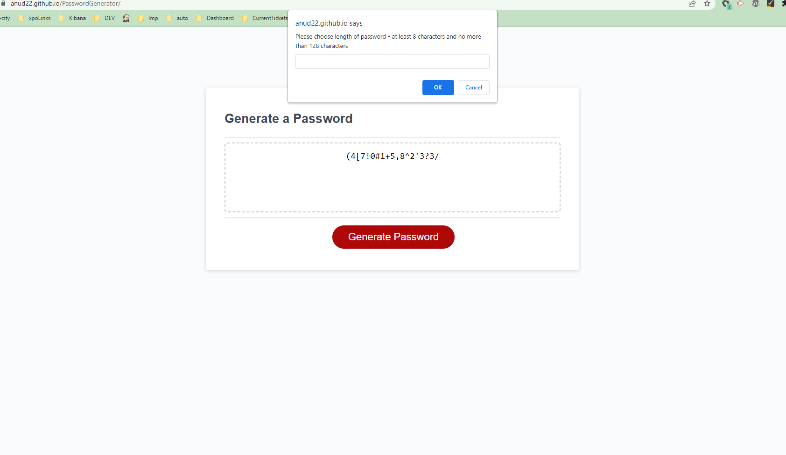

# *Password Generator*

#### The project create an application that enables employees to generate random passwords based on criteria that they’ve selected
 
 

## Table Of Contents
- [Description](#description)
- [Tasks Accomplished](#tasks-completed)
- [Deployment Links](#deployment-links)
- [References](#references)
 
 

### Description
Password Generator - generates random passwords based on user criteria- password length, whether password should include lowercase, uppercase, numeric or special characters. This app will run in the browser and will feature dynamically updated HTML and CSS powered by JavaScript code 

### Tasks Completed
Refactored code by accomplishing following tasks -
* Added Javascript methods to prompt user for the criteria
* Added Javascript methods to validate user input and alert user
* Added Javascript methods to generate password based on user criteria
* Tested positive, negative use cases

### Deployment Links
[Link of Deployed app ](https://anud22.github.io/PasswordGenerator/)

### Screenshot

### References
[msdn web docs](https://developer.mozilla.org/en-US/docs/Web/HTML)
 
[w3 web docs](https://www.w3schools.com/)
